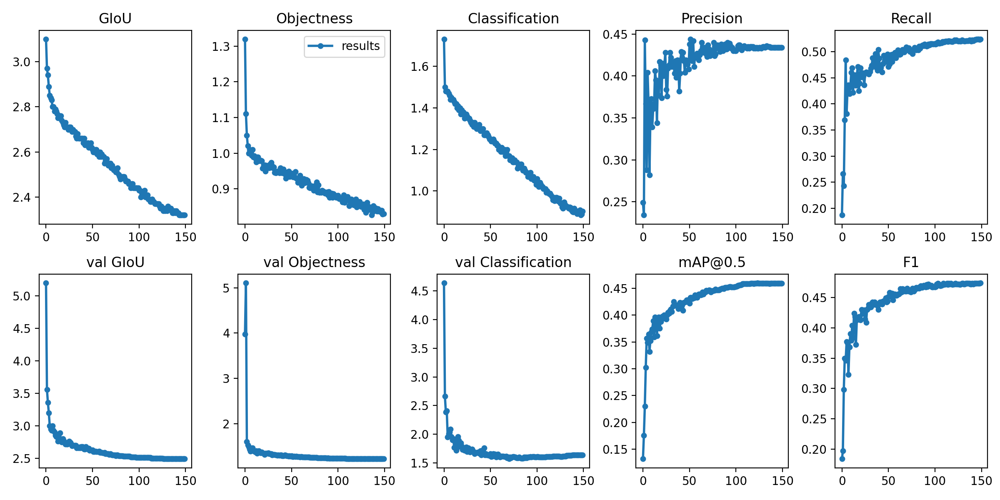

参考论文：

[Learning Efficient Convolutional Networks Through Network Slimming](https://openaccess.thecvf.com/content_ICCV_2017/papers/Liu_Learning_Efficient_Convolutional_ICCV_2017_paper.pdf )

[SlimYOLOv3: Narrower, Faster and Better for UAV Real-Time Applications](https://arxiv.org/abs/1907.11093)

[博客](https://blog.csdn.net/wlx19970505/article/details/111826742 )

模型为改进后的yolov3模型(四个yolo检测头，主要增加了一些多尺度连接)在Visdrone数据集上进行实验：
## Requirements

- Pytorch >=1.6.0
- numpy
- opencv-python
- matplotlib
- pillow
- tensorboard
- torchvision
- scipy
- tqdm

## Training

    CUDA_VISIBLE_DEVICES=0 python train.py --cfg cfg/dense_yolov3_4.cfg --data data/visdrone.data --weights weights/yolov3.weights --epoch 120 --batch-size 16

## Sparse Training

    CUDA_VISIBLE_DEVICES=3 python train.py --cfg cfg/dense_yolov3_4.cfg --data data/visdrone.data --weights weights/best.weights --epoch 300 --batch-size 16 --sr_mode 1 --s 0.003

其中sr_mode表示三种稀疏策略：

1. mode==1: 恒定s给bn回传添加额外梯度
2. mode==2: 全局s衰减，前50%epoch恒定s，后50%恒定s*alpha
3. mode==3: 局部s衰减：前50%epoch恒定s，后50%中，对percent比例的通道保持s，1-percent比例的通道衰减s*alpha
    
## 通道剪枝

    CUDA_VISIBLE_DEVICES=0 python slim_prune.py --cfg cfg/dense_yolov3_4.cfg --data data/visdrone.data --weights weights/best.pt --global_percent 0.8 --layer_keep 0.01 --img_size 800

全局剪80%,评估的图像分辨率为800：

## 层剪枝
    CUDA_VISIBLE_DEVICES=0 python layer_prune.py --cfg cfg/prune_0.8_keep_0.01_dense_yolov3_4.cfg --data data/visdrone.data --weights weights/prune_0.8_keep_0.01_best.weights --shortcuts 10 --img_size 800

剪掉10个shortcut层,评估的图像分辨率为800：

## 微调恢复训练

    CUDA_VISIBLE_DEVICES=0 python train.py --cfg cfg/prune_10_shortcut_prune_0.8_keep_0.01_dense_yolov3_4.cfg --data data/visdrone.data --weights weights/prune_10_shortcut_prune_0.8_keep_0.01_best.weights --epoch 150 --batch-size 16

训练结果：

**最终的结果对比**

